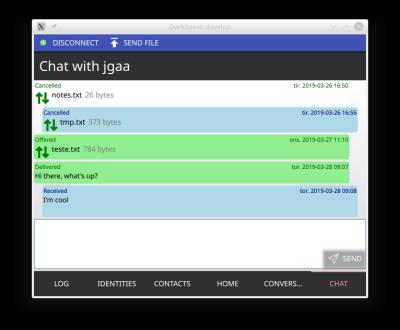
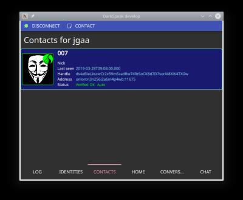

# DarkSpeak

Secure Peer to Peer Instant Messenger, using the Tor network for anonymity and best practice cryptorafic measures to provide privacy and authenticity.

Screenshots

 

# Mission Statement

To make a Secure and Private Communication Platform for Good People.

# Ad free

This application does not collect data about you, and it does not serve ads. It's very purpose is to prevent greedy and hostile entities to dig into your conversations and social network for manipulation, profit & greed.

# Secure and anonymous

All communication is encrypted using Public Key Cryptography (PKS) at the endpoints. Not even the Tor proxy-servers sees the content of any message or even the signaling. There are no central servers and no company-run services. That mean's that there are no-one to subpoena to get even the metadata regarding any conversation. The only traces left of any communications are the TCP connections in the Tor network.

Each peer run it's own Tor Hidden Service. This means that DarkSpeak will work as long as Tor works at any given time and place in the world. If a government feels threatened by Free Speech (and it seems like most of them do), there is still no way they can shut you down. There are no domain-names to block or take over and no IP addresses to block. If Tor works, you are free to talk with whoever you want.

# Alternative networks

The protocol used by DarkSpeak does not depend on Tor. It is designed so that it can be used by alternative networks in the future, or even directly over TCP (if no anonymity is required). At the moment however, only Tor is used.

# History

This project began in April 2016, when I wanted to chat with my friends without Facebook, Google, NSA or anyone else overseeing our conversations. The idea that private conversations are no longer possible, and that we just have to accept that, provokes me. So I used the, now dead, "Tor Chat" project as a starting-point for a protocol, and wrote my own client in C++, using QT and QML for GUI.

However, because the legacy Tor Chat client was bundling an obsolete Tor server, my program was unable to maintain reliable connections with actual "Tor Chat" users. So at some point I decided to learn from my experience with the original implementation and write a new one from scratch.

The [original implementation](https://github.com/jgaa/darkspeak/tree/original-impl-torchat-prot) is still available.

---
# Current status

One thing that has always been important to me is privacy. It was a core value handed down to me by my father. In today’s society, there are very few opportunities to have private conversations using any kind of technology. All telecom protocols and most messaging providers are required by law (or pressured by governments) to give authorities full access to listen in on any conversations they care about.

Even for peer-to-peer encrypted apps, they still require access to metadata, like who is communicating with whom, and when. There are many problems with this, ranging from the philosophical *“Why is the government terrified of its citizens having private conversations?”*, to the technical, where hackers gain access to these tap points to eavesdrop and extract data.

One known example is the so-called [“Salt Typhoon”](https://en.wikipedia.org/wiki/Salt_Typhoon) campaign, first detected in mid-2024, in which Chinese state-linked hackers apparently targeted the very network elements U.S. and allied governments use to conduct lawful intercepts (the “backdoors” mandated for wiretapping) across multiple telecom operators.

There is also a constant push from *Democracies In Name Only*, like the UK, various EU countries, and the US, to install similar tap points in all online encrypted peer-to-peer communication. Similar efforts, often using *"protecting the children"* as an excuse, aim to mandate identifiable online identities across all kinds of social media. (We just have to look at Gaza, and the poverty in their own streets, to see how much those governments *really* care about children.)

Privacy and free speech, including **anonymous free speech**, is an **absolute requirement for a functioning democracy**.

In 2020, I thought hard about this project. I was working intensely for a startup and had less time than I usually do for side projects. I was also fearful of being targeted by Europol (a police force that already has far too much power), or by some intelligence agency, simply for making an app that makes strong privacy even possible. We all know how easy it is for governments to make anyone’s life far from joyful.

**I decided to postpone further work on this project for now**. If and when I ever feel strong enough - and willing to lose everything - I will finish it.
